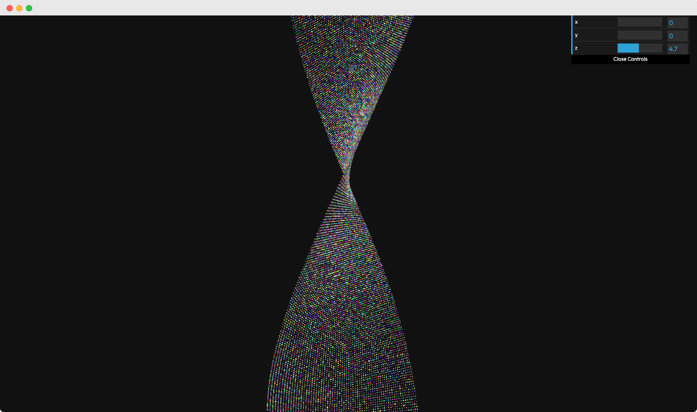

# FrontendMentor Challenge | NFT Preview Card Component

This is a challenge from FrontendMentor.   
You can find the description of the task here: 
https://www.frontendmentor.io/challenges/nft-preview-card-component-SbdUL_w0U



My goal in this challenge was to:
- use stylus as preprocessor
- use webpack together with gulp
- make use of lotties for the hover effect
- build something with threeJS

### How to run
```bash
git clone https://github.com/jeromehaas/nft-preview-card-component-fm
cd nft-preview-card-component-fm
nvm use
npm install 
npm start
```